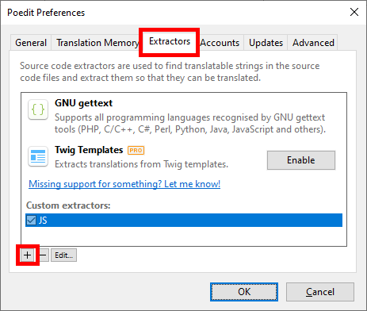
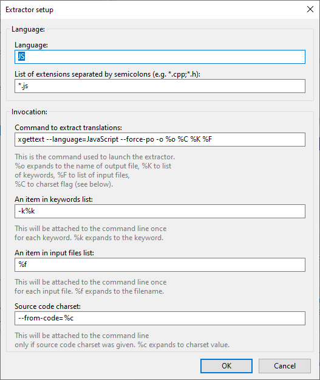
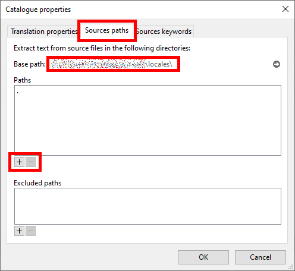
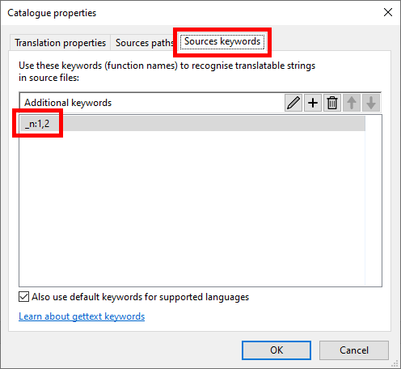
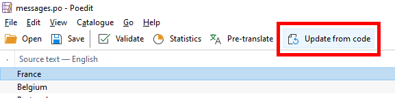
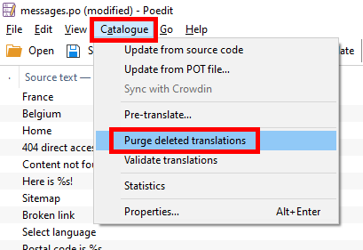

# Manage translations with Poedit

- [Installation](#installation)
- [Add a Javascript extractor](#add-a-javascript-extractor)
- [Configure a translations file](#configure-a-translations-file)
- [Update from code](#update-from-code)

## Installation

https://poedit.net/

## Add a Javascript extractor

Browse to `File` > `Preferences...`

Then tab `Extractors` and `+`

| Parameter                       | Value
|-|-|
| ‪Language                        | `JS`
| List of extensions              | `*.js`
| Command to extract translations | `‪xgettext --language=JavaScript --force-po -o %o %C %K %F`
| An item in keywords list        | `‪-k%k`
| An item in input files list     | `‪%f`
| Source code charset             | `‪--from-code=%c`

## Configure a translations file

Open a PO file, then browse to `Catalog` > `Properties...`

On tab `Sources paths`, ensure that `Base path` is correctly set. If not, add and/or remove folders to the list.

On tab `Sources keywords`, add the keyword `_n:1,2`.

## Update from code

Once configured, Poedit is able to scan Javascript source code and find occurences of keywords:
- `_('singular')`
- `_n('singular', 'plural')`

When Poedit updates translations, it only comments them. To delete them from the PO file they must be purged.

